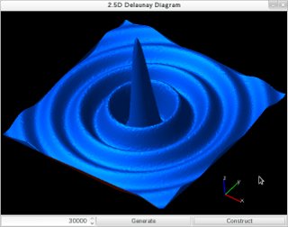

# 2.5D Delaunay Diagram Application
This is a C++ 11 application that construct the 2.5D delaunay diagram. The 2.5D diagram is constructed from vertices that is generated randomly by using the 3D convex hull. The book "[杉原厚吉著 「FORTRAN 計算幾何プログラミング」岩波書店](http://home.mims.meiji.ac.jp/~sugihara/books/sbooks.html, "reference") (Kokichi Sugihara "FORTRAN Computational Geometry")" is referred to make this application.

## Screen Shot

## Dependency
* g++ 4.8.1
* gtkmm 2.24.4
* gtkglextmm 1.2.0
* freeglut 2.8.1
* boost 1.54.0
